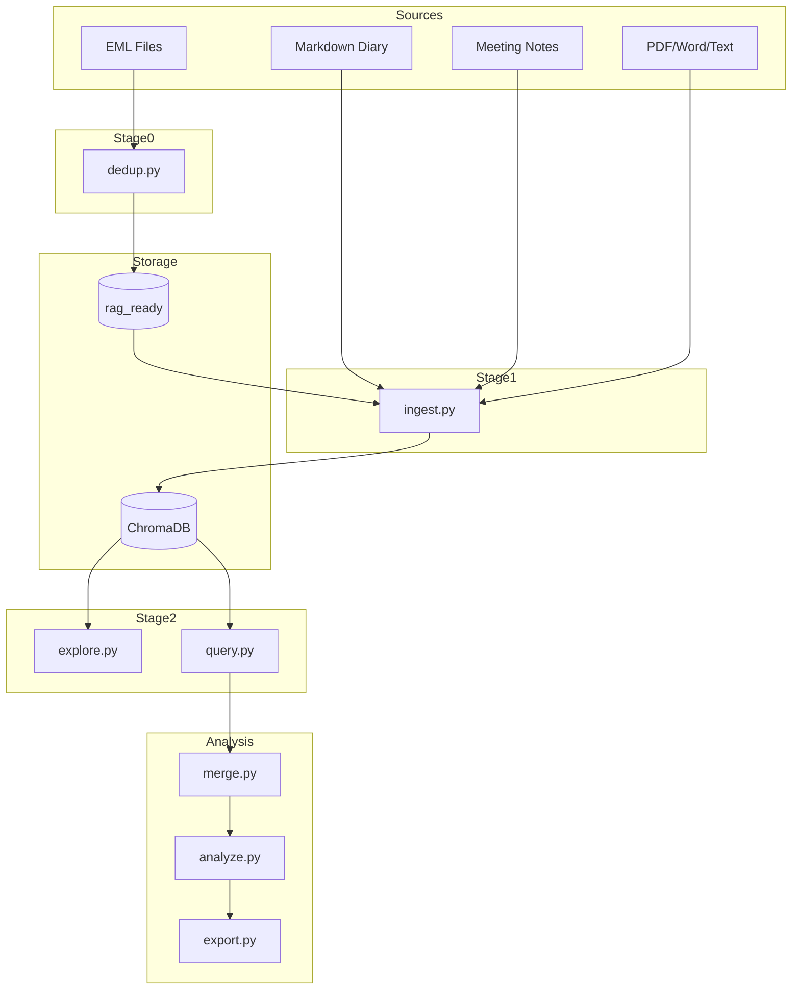

# Architecture

Foxhound is a local-first, multi-source analysis pipeline built as a series of standalone CLI scripts.

## Design Principles

- **Pipeline stages** — Each script is independent and handles one stage
- **Local-first** — Everything runs on your machine; cloud is opt-in
- **Cost safety** — All paid API calls require explicit confirmation
- **Privacy-first** — Pseudonymisation before any cloud API call
- **Two-tier storage** — Raw sources preserved untouched; deduplicated text in `data/rag_ready/`

## Pipeline Stages

## Components

### Parsers

All source types share a unified schema defined in `parsers/base_parser.py`. Each parser extends `BaseParser` and returns documents via `make_document()`, which fills defaults for missing fields.

| Parser | Source Type | Format |
|--------|-----------|--------|
| `EmailParser` | Email | `.eml` files |
| `DiaryParser` | Diary/logs | Markdown |
| `MeetingParser` | Meeting notes | Word/Markdown |
| `DocumentParser` | Documents | PDF/Word/text |

### Storage

- **`data/rag_ready/`** — Deduplicated thread directories with metadata and clean text
- **`data/chroma_db/`** — ChromaDB persistent vector database
- **`data/alias_map.json`** — Pseudonymisation forward/reverse mapping

### Embedding

Uses `all-MiniLM-L6-v2` from sentence-transformers — free, local, no API key needed. Documents are chunked at 1000 characters with 200-character overlap.

### Vector Database

ChromaDB with a single collection (`all_sources`) storing all source types. Metadata filters enable type-specific queries while maintaining cross-source search.

## Data Flow

1. Raw sources are parsed into unified document schema
2. Email threads are deduplicated and stripped of quoted text
3. Documents are chunked and embedded into ChromaDB
4. Queries retrieve chunks by cosine similarity + metadata filters
5. Chunks are collapsed back to documents via `dedup_chunks()`
6. Optional AI analysis applies LLM triage then deep analysis
7. Results are exported for review or pasting into external tools
