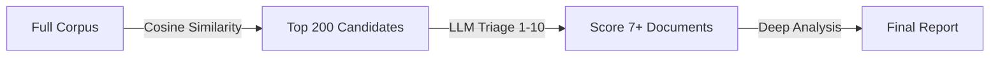

# Two-Stage Scoring

Foxhound uses two different scoring methods at different pipeline stages, each measuring something different.

## Stage 1: Cosine Similarity (Search)

| Property | Detail |
|----------|--------|
| **Tool** | `query.py` |
| **Method** | Cosine similarity (0.0-1.0) |
| **Measures** | Textual similarity between query and document embeddings |
| **Cost** | Free |

Cosine similarity compares the mathematical "direction" of two text embeddings. It's fast and free, making it ideal for casting a wide net. However, it's a rough filter — it can miss contextually relevant results that use different wording.

```bash
# Cosine similarity scores appear in search results
uv run python query.py --semantic "budget concerns" --top-k 100
```

## Stage 2: LLM Triage (Analysis)

| Property | Detail |
|----------|--------|
| **Tool** | `analyze.py --full-pipeline` |
| **Method** | LLM relevance score (1-10) |
| **Measures** | Contextual relevance to your specific analysis question |
| **Cost** | Free (local Mistral 7B) or paid (cloud models) |

LLM triage uses a language model to actually read each document and score how relevant it is to your specific context. This catches documents that are contextually relevant but use different terminology.

```bash
# The full pipeline runs triage first, then sends high-scoring docs to deep analysis
uv run python analyze.py results.json \
  --full-pipeline \
  --context "Identify budget risks" \
  --model deepseek
```

## How They Work Together



1. **Search** (`query.py`) — Cosine similarity retrieves the top-K most textually similar documents
2. **Triage** (`analyze.py --full-pipeline`) — LLM reads each candidate and scores contextual relevance 1-10
3. **Analysis** — Only documents scoring 7+ are sent to the paid model for deep analysis

This two-stage approach minimises cost while maximising relevance. The free cosine similarity stage casts a wide net, and the LLM triage stage filters to the most relevant results before expensive deep analysis.

## When to Use Each

| Scenario | Approach |
|----------|----------|
| Quick exploration | `query.py` with cosine similarity only |
| Cost-sensitive analysis | `--full-pipeline` (triage filters before paid model) |
| Maximum recall | Multiple searches + merge, then `--full-pipeline` |
| Free-only workflow | `query.py` for search, `--local` for analysis |
