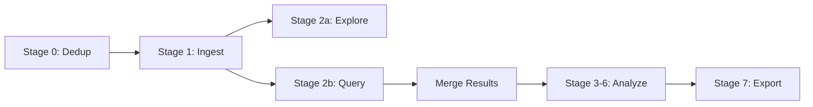

# Foxhound

A local, privacy-first document search and analysis pipeline. Ingest emails, diary entries, meeting notes, and documents into a single searchable corpus — then explore with semantic search and optional AI-powered analysis.

Foxhound tracks down what matters across large, messy document collections without sending anything to the cloud (unless you choose to).

## Key Features

| Feature | Description |
|---------|-------------|
| **Multi-source ingestion** | Emails, diaries, meeting notes, PDFs, Word docs |
| **Semantic search** | Find conceptually similar content, not just keyword matches |
| **Two-stage scoring** | Cosine similarity for retrieval, LLM triage for relevance |
| **Privacy-first** | Pseudonymisation before any cloud API call |
| **Cost controls** | Confirmation prompts and hard limits before any spend |
| **Local-first** | Everything runs on your machine — cloud is optional |

## Pipeline Overview



## Quick Start

```bash
# Configure sources
cp config.example.yaml config.yaml

# Deduplicate email threads
uv run python dedup.py

# Embed all sources into ChromaDB
uv run python ingest.py

# Explore your corpus
uv run python explore.py

# Semantic search
uv run python query.py --semantic "project concerns" --top-k 100
```

## In This Section

- [Getting Started](./getting-started) - Install and configure Foxhound
- [Use Cases](./use-cases/) - Real-world scenarios and workflows
- [Guides](./guides/) - Step-by-step how-to guides
- [Concepts](./concepts/) - Architecture and design decisions
- [Reference](./reference/) - CLI commands and configuration options
- [FAQ](./faq) - Common questions about data integrity, privacy, and search
